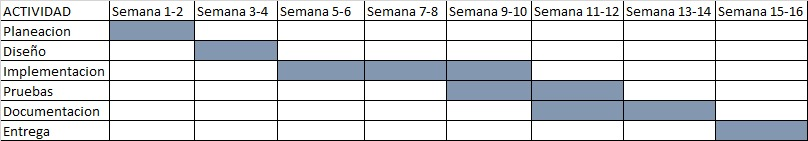

# La Pantalla Magica
El software **La Pantalla Mágica** es un programa de consola desarrollado en Python cuyo propósito es apoyar la gestión operativa y administrativa del **Cinema Universitario de la Universidad de Antioquia**.

Permitirá a los usuarios **registrarse, consultar disponibilidad de películas y asientos, realizar y cancelar reservas, generar facturas y reportes administrativos**, brindando una experiencia sencilla y eficiente tanto para el público universitario como para la comunidad externa.

---
### Integrantes:
*  Sofia Vallejo Martinez
> Soy estudiante de Ingeniería Industrial en la Universidad de Antioquia, tengo 19 años y me caracterizo por ser una persona empática, comprometida y responsable. Me gusta asumir retos y aprender cosas nuevas, y siempre busco dar lo mejor de mí en todo lo que hago. Tengo habilidades de liderazgo y disfruto trabajar en equipo, aportando ideas y ayudando a que las cosas salgan bien.

*  Maria José Molina López
> Soy estudiante de Ingeniería Industrial en la Universidad de Antioquia, actualmente tengo 19 años, me considero una persona comprometida, responsable y con un fuerte deseo de aprender y superarme día a día. Disfruto asumir nuevos retos que me permitan crecer tanto en lo personal como en lo academico. Me destaco por mi disposición para trabajar en equipo, mi capacidad para comunicarme y colaborar con los demás. Además, soy organizada, proactiva y siempre busco aportar ideas que contribuyan al logro de los objetivos comunes.

*  Daniel Santiago Martínez Daza
> Soy estudiante de Ingeniería Industrial en la Universidad de Antioquia. Tengo 18 años y me considero una persona responsable, respetuosa, amable y siempre dispuesta a servir a los demás y a colaborar en lo que sea necesario. Me gusta aprender constantemente y, por medio del diálogo, establecer vínculos con mis compañeros para trabajar juntos hacia un mismo objetivo y buscar siempre lo mejor para todos.
Entre mis habilidades destaco mi capacidad de liderazgo, la buena comunicación, la disposición para colaborar y el compromiso de apoyar a los demás en todo momento.

---
### Licencia

<a href="https://github.com/sofiavallejom-glitch/ProyectoFinal-LaPantallaMagica/edit/main/README.md ">Pantalla Magica</a> © 2025 by <a href="sofiavallejom-glitch">Sofia Vallejo</a> is licensed under <a href="https://creativecommons.org/licenses/by-nc-nd/4.0/">CC BY-NC-ND 4.0</a>

## Objetivos del Software

* **Objetivo general:**
  Desarrollar un software de consola en Python para gestionar el Cinema Universitario de la UdeA, facilitando la reserva de sillas, cobro de entradas y administración de reportes.

* **Objetivos específicos:**

  * Registrar y administrar usuarios según su tipo (estudiantes, docentes, administrativos, oficiales internos, público externo).
  * Consultar la cartelera de películas disponibles cada fin de semana.
  * Permitir reservas y cancelaciones de asientos (121 sillas disponibles).
  * Generar facturas y comprobantes de pago.
  * Consolidar reportes administrativos de ingresos y ocupación.

---

## Beneficios del Software

* Organización eficiente de reservas y cobros.
* Reducción de errores humanos en el control manual.
* Interfaz de consola clara, fácil de usar y amigable para el usuario.
* Control administrativo mediante reportes exportables (CSV).
* Apoyo a la comunidad universitaria con un espacio cultural más accesible y dinámico.

---

## Requisitos del Software

### Requisitos Funcionales

1. El sistema debe permitir registrar usuarios solicitando nombre, apellido, documento y tipo de vínculo, validando que los datos sean correctos (letras donde van letras, números donde van números y longitudes mínimas requeridas).

2. El programa debe mostrar la sala de cine compuesta por 11 filas y 11 columnas, representando los asientos disponibles con “O” y los ocupados con “X”, usando las funciones establecidas para crearlas e imprimirlas.

3. El usuario registrado debe poder realizar reservas ingresando su documento, visualizando la sala y seleccionando su asiento en formato letra+número (como A5 o C10).

4. El sistema debe verificar si el asiento elegido está disponible y, de ser así, cambiarlo de “O” a “X” y registrar la reserva con un código único y el valor correspondiente según el tipo de vínculo.

5. El sistema debe permitir cancelar reservas mostrando todas las reservas asociadas al documento ingresado y permitiendo seleccionar cuál se desea eliminar; al cancelar la reserva, el asiento debe volver a estar disponible en la sala.

6. El sistema debe mostrar las películas disponibles para el fin de semana junto con sus respectivos horarios y la disponibilidad de la sala.

7. El sistema debe permitir acceder a un panel administrativo protegido por usuario y contraseña, desde donde se podrá consultar la cantidad de usuarios registrados, el total de reservas, la ocupación general de la sala y otra información relevante.

8. El programa debe permitir al usuario salir del sistema en cualquier momento seleccionando la opción correspondiente del menú principal.

### Requisitos No Funcionales

1. El sistema debe contar con menús intuitivos, claros y fáciles de usar, que guíen al usuario mediante mensajes explicativos durante todas las operaciones.

2. La interacción debe realizarse completamente por consola, evitando interfaces gráficas para garantizar simplicidad y compatibilidad.

3. El programa debe ofrecer respuestas rápidas al registrar usuarios, mostrar la sala o procesar reservas para asegurar una buena experiencia del usuario.

4. El sistema debe ser compatible con cualquier sistema operativo que tenga instalado Python 3.10 o superior y no debe depender de librerías externas.

5. La seguridad del sistema debe garantizarse mediante validaciones de datos y el uso de un acceso restringido al panel administrativo, donde se requiere usuario y contraseña.

6. El sistema debe evitar datos duplicados, inconsistencias o errores de reserva, garantizando que un asiento ocupado no pueda reservarse nuevamente.

7. El programa debe mantener una estructura de código clara, organizada y modular, lo que facilita su mantenimiento, comprensión y futuras ampliaciones.

8. El sistema debe ser portable y ejecutarse sin configuraciones adicionales, permitiendo su uso desde cualquier equipo una vez descargado.

---

## Actividades del Proyecto

1. **Planeación:** Revisión de requerimientos, creación de acta de compromiso.
2. **Diseño:** Definición de clases principales (Usuario, Película, Reserva, Factura, Reporte).
3. **Implementación:** Desarrollo del programa en Python.
4. **Pruebas:** Validación de cada funcionalidad del sistema.
5. **Documentación:** Elaboración de manual de usuario y guías de instalación.
6. **Entrega:** Publicación en GitHub con repositorio organizado.

---
## Cronograma del Proyecto 
* Diagrama de Gantt

---
## Presupuesto del Proyecto

* **Equipo:** 3 estudiantes
* **Tiempo total invertido:** 50 horas
* **Referencia:** 1 Salario Mínimo Legal Vigente (SMLV) = 1.300.000 COP (aprox.)
* **Horas de práctica estándar:** 240 horas / mes
* **Valor hora práctica:** 1.300.000 / 240 = **5.417 COP/hora**

### Cálculo:

* 50 horas * 5.417 COP/hora = **270.850 COP**
---

## Plan Versionado
* Al inicio del proyecto, el programa estaba organizado completamente por casos dentro del menú principal. Cada opción del menú incluía todo el código necesario para ejecutarla. Por ejemplo, el registro del usuario se escribía entero dentro del case '1': allí mismo estaban todas las preguntas del nombre, apellido, cédula, validaciones y almacenamiento. Así mismo funcionaban las demás partes del menú. Aunque esto servía como primer borrador, hacía que el código fuera muy largo, repetitivo y difícil de mantener.

* En esa primera versión también empezamos intentando manejar los usuarios únicamente mediante diccionarios porque nos parecía más sencillo guardar los datos con claves y valores. Incluso pensamos en construir una “base de datos” para guardar esta información, pero luego de consultar con el profesor, nos indicó que todavía no era necesario usar archivos externos, y que era mejor manejar la información con listas, por lo que cambiamos nuestra estructura a listas de diccionarios.

* En cuanto al registro de usuarios, al principio no habíamos incluido validaciones estrictas. Permitíamos nombres o apellidos con números, símbolos o con pocas letras porque no estábamos usando funciones como .isalpha(). Luego nos dimos cuenta de que esto generaba errores e inconsistencias, así que incorporamos validaciones para garantizar que el nombre y apellido fueran únicamente letras y tuvieran un mínimo de 3 caracteres. También mejoramos la validación de la cédula, ya que inicialmente no teníamos controles para asegurarnos de que fueran solo números. Finalmente, dejamos la regla de que el documento debía tener entre 3 y 15 dígitos.

* Posteriormente, decidimos hacer una reorganización completa del código. Dejamos de colocar todo dentro de los case del menú y pasamos a usar funciones independientes como registrar_usuario(), registrar_reserva(), cancelar_reserva() y consultar_funciones(). Esto nos permitió tener un código más limpio, fácil de mantener, más legible y con menos repeticiones. Fue una de las mejoras más importantes de todo el proyecto.

* Asimismo, tomamos la decisión de agregar la parte superior donde aparece el título del cine y la presentación de la sala. Lo incluimos para que el programa se viera más claro y más completo visualmente. Además, al mover estas funciones a la parte superior, conseguimos que el menú quedara más limpio y que la impresión de la sala siempre estuviera disponible.

* Finalmente, adoptamos un diseño mixto: listas para almacenar usuarios y reservas, y diccionarios para representar cada usuario y cada reserva individual. Esto concluyó en una versión más estable, más organizada y completamente funcional del Cinema La Pantalla Mágica.
---

